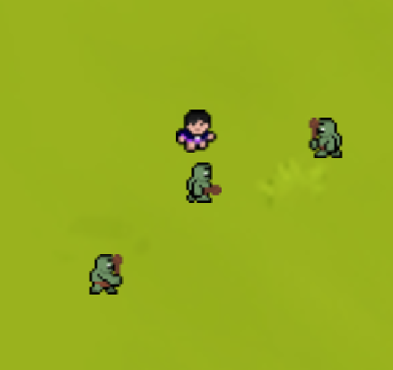
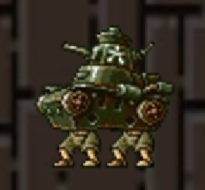

# Timothy Chen & Ryan Chan ICS3U1 CPT

Game Objective:
 Boss Bachi is a soulslike game with 2.5D movement. You are the "One Who Left It All Behind" bringing his overwhelming intensity to the battlefield. After losing his battle against the "Strongest in History" you are stripped of all items and powers before being sealed into the Prison Realm. After only a few seconds, you perished, but you find yourself revived with two magical weapons at hand. These magical weapons enable you to kill the enemies inside of the Prison Realm. The Prison Realm is ruled by Great Beings from many different eras who are spread throughout different lands. In the land of Alchemara ruled by "Tanker the Wheeless" to the Lunar Moon Kingdom where "Fiona the Stan" lies dormant. To the current Honoured One, "Newton the Master of Laws". Your goal is to escape the Prison Realm and achieve the title of "Honoured One" by defeating the Great Beings throughout the lands. 

 There are two different stages, the tutorial stage and stage 1. The tutorial stage is your first introduction to the game and the game experience that will be ahead. Stage 1 will be your first taste of a boss fight, where your skills and patience will be tested. Once you reach level 1 will be able to try again as many times as you want until you kill the tank boss.

Gameplay Mechanics:

Movement: WASD

Dash: Spacebar

Attack: Mousepress

Confirm Menu Button : ENTER

Limitations:

(1) The player cannot move outside of the drawn screen.

(2) Dash has a 3-second cooldown before it can be used again.

